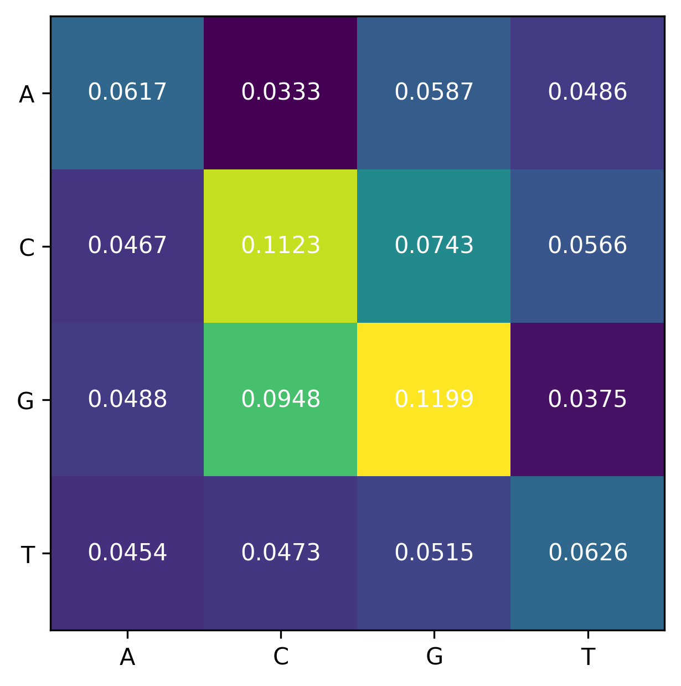
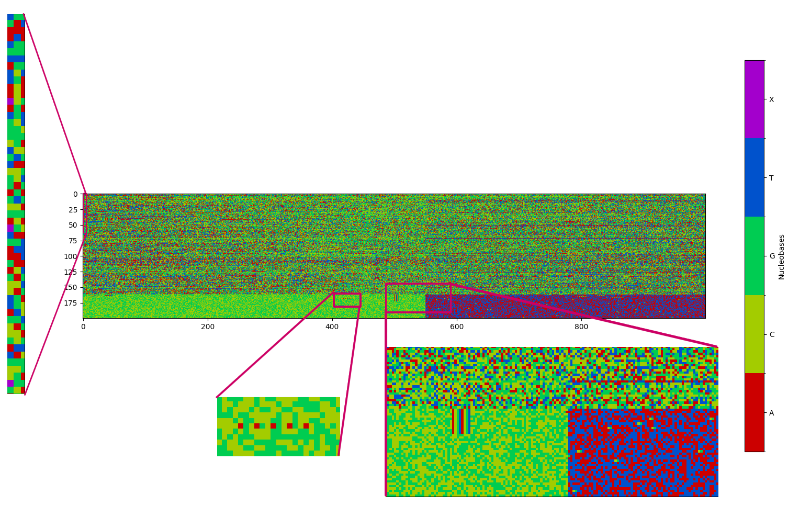

# LML take-home exercise report

## Features
This program is designed to be a simple command-line utility that carries out the statistical analyses in the exercise brief. It makes use of a `settings.json` file which stores various configuration options, and saves the outputs of the analyses to `results/`.

## Findings
### Basic statistics
**GC content:** GC content is the fraction of the DNA sequence that is made up of either Guanine or Cytosine. For the given dataset, the average GC stats were recorded as follows:
```
gc_distribution: 0.5914000000000004,
gc_skew: 0.02263081274874891
```
Which indicates that the average sample is GC-rich (>50%), and that there is a slight bias towards Guanine (skew was calculated as $\frac{G - C}{G + C}$). The sequences with the minimum and maximum values for each stat are presented below. The sequence number (0 - indexed) where this value was found is indicated in parentheses.
|     | distribution | skew        |
|-----|--------------|-------------|
| min |  0.357 (110) | -0.260 (95) |
| max |  0.833 (5)   |  0.286 (54) |

**Dinucleotide frequencies:**
Figure 1 shows a heatmap of the average dinucleotide frequencies in the dataset. The highest density dinucleotide (or 2-mer) was GG, followed by CC and GC, further showing that this is a very GC-rich dataset.

_Figure 1_

### K-mer statistics
The table below shows the rankings (with no. of occurrences in parentheses) of the most common K-mers for all values of K in the settings. In the case of the 3- and 4-mers, the top spot is taken by a simple sequence consisting of the same base, but this trend is somewhat broken with the 5-mer -- here we see a sequence with 2 bases (GGGGC) occurring more than the next most popular one (GGGGG)

|   | 3-mers     | 4-mers      | 5-mers       |
|---|------------|-------------|--------------|
| 1 | GGG (9636) | GGGG (3805) | GGGGC (1529) |
| 2 | CCC (8835) | CCCC (3436) | GGGGG (1376) |
| 3 | GGC (7640) | GGGC (3320) | GGGCG (1348) |
| 4 | GCC (7490) | GCCC (3098) | GCCCC (1334) |
| 5 | CGG (6283) | GGCC (2904) | CGGGG (1324) |

## Interesting overall patterns
### Palindromes
As per the requirements of the task, I report only palindromes that are 20 or more base pairs in length and contain at least 3 of the 4 valid nucleobases. Both these parameters can be changed via `settings.json`, however. I found that there really weren't many palindromes in the dataset -- only 8 overall, and most of them are the only palindrome in their respective DNA sequence. They are listed below:
```json
{
    "8": {
        "95": "CCCCGGCCCCACCCCGGCCCC",
        "100": "GCCCCACCCCGGCCCCACCCCG"
    },
    "10": {
        "173": "TCACACACACACACACACACACACACACACT"
    },
    "16": {
        "534": "TCGCCTCGCTCCTCGCTCCGCT"
    },
    "75": {
        "667": "CGCGTGCGGGCGGGCGTGCGC"
    },
    "91": {
        "369": "CCCGGCCTCCGCCTCCGGCCC"
    },
    "140": {
        "706": "GTGGCGGCGGCGGCGGCGGTG",
        "705": "GGTGGCGGCGGCGGCGGCGGTGG"
    }
}
```
The longest of these was found in the 11th (0-indexed) DNA sequence at position 173 and is 31 base pairs long.
### Invalid sequences?
Another potentially interesting finding is that there are some (to me at least) unexpected nucleobases in the dataset:
```json
{
    "12": {
        "0": "E"
    },
    "30": {
        "0": "N"
    },
    "52": {
        "0": "O"
    },
    "72": {
        "0": "M"
    },
    "100": {
        "0": "E"
    },
    "126": {
        "0": "H"
    },
    "150": {
        "0": "U"
    },
    "178": {
        "0": "N"
    }
}
```
I've defined "valid" bases as ones that appear in [A, C, G, T] (again, this is a modifiable parameter in `settings.json`). As can be seen above, there are only 8 of these invalid bases in the whole dataset, and they occur exclusively at the beginning of a DNA sequence
### GC - AT split
From the 162nd sequence onwards, a striking visual difference can be seen (_Figure 2_). Whereas before this point, the nucleobases are fairly evenly distributed, each of the following sequences are roughly split in half -- the first half is extremely GC-rich, reaching 100% for most sequences after the 162-mark. As if to compensate for this, the other half of the sequence is almost 100% AT-rich.

## Summary
All the analysis points to this being a very GC-rich dataset overall, with some interestingly distributed bases in the last quarter or so of the samples. It is unsurprising that none of the palindromic substrings matching our criteria were found in this region (they were all found in the 8 - 140 range).


_Figure 2_

As mentioned earlier, there were some unusual bases occurring at the beginning of some sequences. They have been marked in purple in the zoomed in section on the left in the figure above.